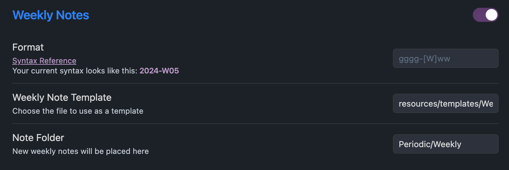
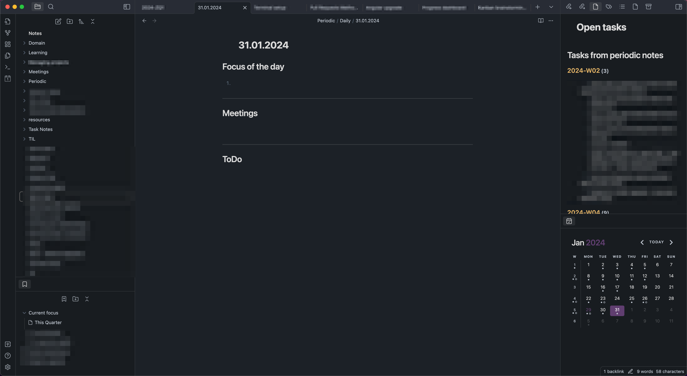

# Obsidian Setup

---
### Table of Contents
1. [Why Obsidian?](#why-obsidian)
2. [Installation](#installation)
3. [Plugins](#plugins)
   1. [Core plugins](#core-plugins)
   2. [Community plugins](#community-plugins)
4. [Layout](#layout)
   1. [Left sidebar](#left-sidebar)
   2. [Main editor area](#main-editor-area)
   3. [Right sidebar](#right-sidebar)
5. [Additional custom settings](#additional-custom-settings)
---

[Obsidian](https://obsidian.md) is a free (and very powerful) note-taking and knowledge organization application.
It is primarily based on Markdown files - which comes with the benefit of simple syntax and direct reusability of the text in many other tools, i.e. Github, Confluence or JIRA.

## Why Obsidian?

There are many other solutions that can be used for achieving the same goals - currently I think Obsidian is the best one.

1. It looks cool - sleek design and not too much clutter
2. It can be used purely with keyboard (less mouse interaction = better productivity)
3. It contains all the needed features, without adding too much complexity
4. Because of its simplicity, it is not a heavy application to run
5. The Markdown files are rendered already during editing, which improves readability
6. Adding new content is really fast and does not require any setup
7. It supports exporting to PDF
8. It is actively maintained and improved
9. Can be even more powerful with added plugins

## Installation

```shell
brew install obsidian
```

## Plugins

### Core plugins

The core plugins that I have enabled:
- backlinks
- bookmarks
- canvas
- command palette
- file recovery
- files
- graph view
- note composer
- outgoing links
- outline
- page preview
- properties view
- quick switcher
- search
- slash commands
- tags view
- templates
- word count


### Community plugins

The plugins that I currently use:
- [Calendar](https://github.com/liamcain/obsidian-calendar-plugin) (by Liam Cain) - adds a calendar widget, great combo with Periodic Notes
- [Dataview](https://github.com/blacksmithgu/obsidian-dataview) (by Michael Brenan) - adds the possibility to query the notes with SQL-like languate. Very useful for listing all the open tasks
- [Editor Syntax Highlight](https://github.com/deathau/cm-editor-syntax-highlight-obsidian) (by death_au) - adds syntax highlighting to code blocks
- [Periodic Notes](https://github.com/liamcain/obsidian-periodic-notes) (by Liam Cain) - allows to automatically create daily / weekly / quarterly notes

#### Calendar


#### Dataview

I kept the default settings that come with the plugin. 

#### Periodic Notes

I have decided to keep all my periodic notes in a separate folder, to keep the main directory clutter-free. I keep them in folder `Periodic`.

##### Daily


I use my daily notes to keep track of my tasks, meetings and goals for the given day. This is also a place for all the small notes that are relevant only for that specific day.

With combination with the Calendar plugin, a new daily note is created whenever I click on a date in the calendar widget. It uses the following template:

```markdown
## Focus of the day

1. 

---
## Meetings


---
## ToDo


```

##### Weekly



I use weekly notes to keep track of tasks that should be completed within the given week (but not necessarily on a specific day). It also serves as a place for me to keep notes relevant for the entire week - i.e. issues encountered during DevRep week, or points for retrospective.
This is also one place that displays all the tasks I was working on during the entire week (grouped by days).

My weekly notes use the following template:

```markdown
## Meetings

## Week at a Glance

### Monday

![[{{monday:DD.MM.YYYY}}#ToDo]]

----

### Tuesday

![[{{tuesday:DD.MM.YYYY}}#ToDo]]

----

### Wednesday

![[{{wednesday:DD.MM.YYYY}}#ToDo]]

----

### Thursday

![[{{thursday:DD.MM.YYYY}}#ToDo]]

----

### Friday

![[{{friday:DD.MM.YYYY}}#ToDo]]

## Tasks for the week

```
##### Monthly

I don't use monthly notes.

##### Quarterly


I use quarterly notes to keep track of more long-term goals, tasks and interesting things to learn / read about in spare moments.

I don't really use a template for them.

> **File naming** - I have decided to use a custom format for the quarterly notes to put them last in the alphabetical order of all my periodic notes. This allows my [open task list](#open-task-list) to be more readable.

##### Yearly

I don't use yearly notes.

## Layout

I have customized the application layout to always have all the relevant information displayed.



### Left sidebar

#### Folder structure

It allows me to quickly see all of my folders. I try to maintain a relevant folder structure - I have separate folders for meeting notes, task notes, periodic notes and learning notes.

#### Bookmarks

I use bookmarks to pin the notes that are most relevant (and for longer than 1 day). Usually the list of bookmarks contains quarterly note for the given quarter, the long-term projects I am involved in and the particular task I am working on. 

### Main editor area

I usually keep a few tabs open - quarterly note, daily note, currently worked on task (plus more, if I need to focus on more topics during given time).

### Right sidebar


#### Open task list

I have a separate file that keeps track of all my open tasks within the periodic notes:

```markdown
## Tasks from periodic notes

   ```dataview
    task
    from "Periodic"
    where !completed
    group by file.name
    ```
```

This snippet works with [Dataview](#dataview) plugin.

I keep it always open in my right sidebar, to have a fast glance on all the things I still have pending.

#### Calendar

I keep my calendar widget in the bottom right corner - it gives a visual representation of the structure of the week and open tasks (an open dot under the day / week number signifies open tasks), but also serves as a shortcut to create a relevant periodic note.

## Additional custom settings

**Themes** - I use Things theme.
**Monospace font** - I use Victor Mono.
